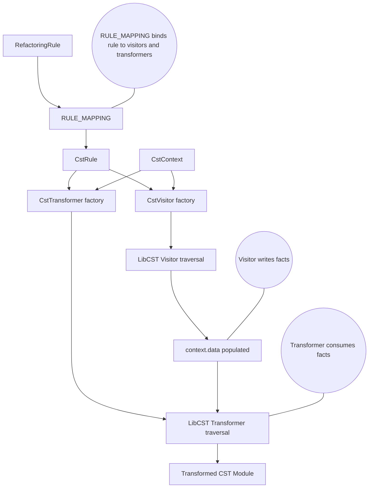

# Arch




# Repo map
```
├── .github
│   └── workflows
│       └── ci_tests.yaml
├── scripts
│   ├── __init__.py
│   ├── create_compiler_style_test_case.py
│   └── create_test_case.py
├── src
│   └── libcst_code_mods
│       ├── core
│       │   ├── __init__.py
│       │   ├── base_cst_transformer.py
│       │   ├── base_cst_visitor.py
│       │   ├── cst_context.py
│       │   ├── cst_rule.py
│       │   └── refactoring_rule.py
│       ├── rules
│       │   ├── __init__.py
│       │   ├── _rule_mapping.py
│       │   └── convert_function_signature.py
│       ├── single_file_transformers
│       │   ├── __init__.py
│       │   ├── _base.py
│       │   ├── convert_function_signature.py
│       │   ├── rename_variable_of_type.py          # Rename all variables of a certain type with the same name, this is useful for custom objects that there will only be 1 instances of at a time.
│       │   ├── reorder_params.py
│       │   ├── replace_param_type_hint.py
│       │   └── replace_return_type_hint.py
│       ├── __init__.py
│       ├── constants.py
│       ├── filters.py                              # simple filters that are applied before the transformation
│       ├── matchers.py                             # some basic matchers
│       ├── node_collector.py                       # the pre-pass stage that collects the context before the transformation
│       ├── transform.py                            # main entrypoint to the code mods
│       └── transform_v2.py                         # main entrypoint to the code mods
├── tests
│   ├── rules
│   │   └── convert_function_signature
│   │       ├── cases
│   │       │   └── case_1
│   │       │       ├── after
│   │       │       │   ├── __init__.py
│   │       │       │   ├── file_1.py
│   │       │       │   └── file_2.py
│   │       │       └── before
│   │       │           ├── __init__.py
│   │       │           ├── file_1.py
│   │       │           └── file_2.py
│   │       ├── __init__.py
│   │       └── test_convert_function_signature.py
│   ├── test_examples
│   │   ├── __init__.py
│   │   ├── calls_print.py
│   │   ├── class_single_method.py
│   │   ├── function_nested_function.py
│   │   ├── function_nested_raises.py
│   │   ├── function_raises_exception.py
│   │   ├── function_single_line.py
│   │   ├── global_assignment.py
│   │   ├── global_assignment_with_type_hint.py
│   │   └── print_with_fstring.py
│   ├── test_transformer_cases
│   │   ├── combinations
│   │   │   └── case_1
│   │   │       ├── after.py
│   │   │       └── before.py
│   │   ├── convert_function_signature
│   │   │   └── case_1
│   │   │       ├── __init__.py
│   │   │       ├── after.py
│   │   │       └── before.py
│   │   ├── rename_variables_of_same_type
│   │   │   └── case_1
│   │   │       ├── __init__.py
│   │   │       ├── after.py
│   │   │       └── before.py
│   │   ├── reorder_params
│   │   │   └── case_1
│   │   │       ├── after.py
│   │   │       └── before.py
│   │   ├── replace_param_type_hint
│   │   │   ├── case_1
│   │   │   │   ├── after.py
│   │   │   │   └── before.py
│   │   │   └── case_2
│   │   │       ├── after.py
│   │   │       └── before.py
│   │   ├── replace_return_type_hint
│   │   │   └── case_1
│   │   │       ├── after.py
│   │   │       └── before.py
│   │   └── __init__.py
│   ├── transformers
│   │   ├── __init__.py
│   │   └── test_transformers.py
│   ├── __init__.py
│   └── test_matchers.py
├── .pre-commit-config.yaml
├── README.md
├── pyproject.toml
├── ruff.toml
└── uv.lock

(generated with repo-mapper-rs)
::
```