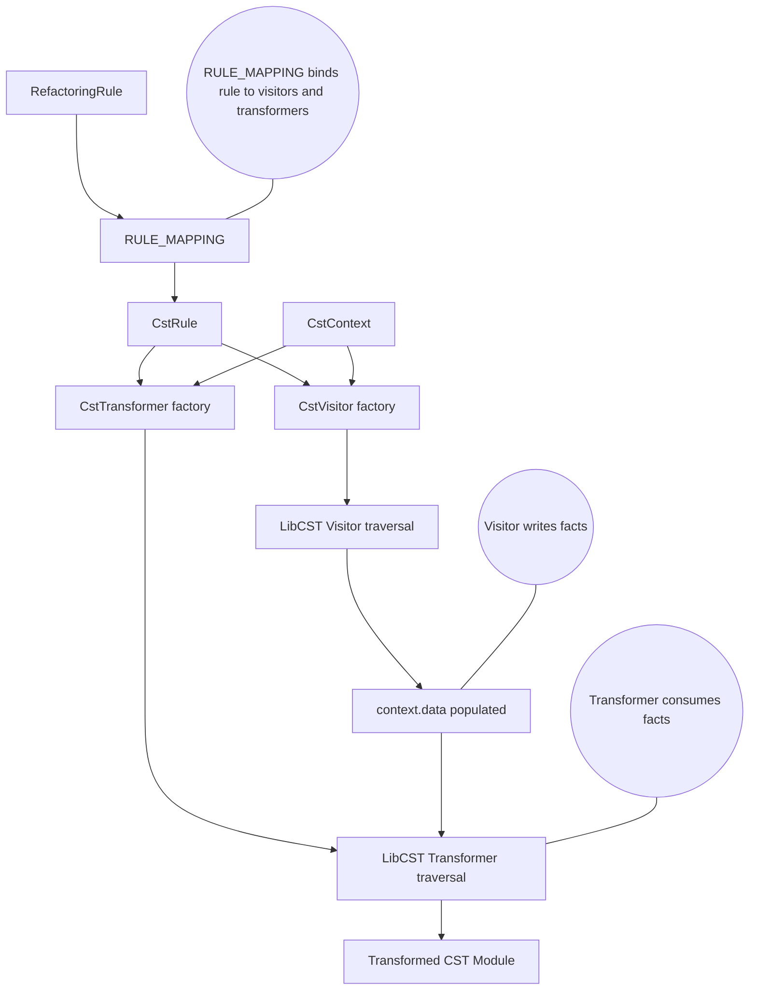

# Arch




# Repo map
```
├── .github
│   └── workflows
│       └── ci_tests.yaml
├── mock_package
│   ├── after
│   │   └── src
│   │       ├── __init__.py
│   │       ├── file_1.py
│   │       └── file_2.py
│   └── before
│       └── src
│           ├── __init__.py
│           ├── file_1.py
│           └── file_2.py
├── scripts
│   ├── __init__.py
│   ├── create_compiler_style_test_case.py
│   └── create_test_case.py
├── src
│   └── libcst_code_mods
│       ├── core
│       │   ├── __init__.py
│       │   ├── base_cst_transformer.py
│       │   ├── base_cst_visitor.py
│       │   ├── cst_context.py
│       │   ├── cst_rule.py
│       │   └── refactoring_rule.py
│       ├── rules
│       │   ├── general
│       │   │   ├── active
│       │   │   │   ├── __init__.py
│       │   │   │   ├── add_guards_from_typehints.py
│       │   │   │   ├── add_kwargs.py
│       │   │   │   ├── convert_function_signature.py
│       │   │   │   ├── make_dependent_on_args.py
│       │   │   │   ├── remove_kwargs_if_default_value.py
│       │   │   │   └── reorder_params.py
│       │   │   ├── passive
│       │   │   │   ├── __init__.py
│       │   │   │   ├── invert_guards.py
│       │   │   │   ├── invert_loop_guards.py
│       │   │   │   ├── replace_multiple_function_calls_in_comp_with_walrus.py
│       │   │   │   └── replace_mutable_defaults_with_guard_clause.py
│       │   │   └── __init__.py
│       │   ├── pyspark
│       │   │   └── passive
│       │   │       ├── __init__.py
│       │   │       ├── _replace_multiple_with_column_calls.py
│       │   │       ├── _replace_with_column_in_for_loop.py
│       │   │       ├── replace_multiple_with_column_calls.py
│       │   │       ├── replace_multiple_with_column_renamed_calls.py
│       │   │       ├── replace_with_column_in_for_loop.py
│       │   │       └── replace_with_column_renamed_in_for_loop.py
│       │   ├── __init__.py
│       │   ├── _cst_to_matcher.py
│       │   ├── _cst_utils.py
│       │   └── _rule_mapping.py
│       ├── __init__.py
│       ├── __main__.py
│       ├── constants.py
│       ├── engine.py                                                                # main entrypoint to the code mods
│       ├── matchers.py                                                              # some basic matchers
│       ├── node_collector.py                                                        # the pre-pass stage that collects the context before the transformation
│       └── utils.py
├── tests
│   ├── rules
│   │   ├── general
│   │   │   ├── active
│   │   │   │   ├── add_guards_from_typehints
│   │   │   │   │   ├── cases
│   │   │   │   │   │   └── case_1
│   │   │   │   │   │       ├── after
│   │   │   │   │   │       │   ├── __init__.py
│   │   │   │   │   │       │   ├── file_1.py
│   │   │   │   │   │       │   └── file_2.py
│   │   │   │   │   │       └── before
│   │   │   │   │   │           ├── __init__.py
│   │   │   │   │   │           ├── file_1.py
│   │   │   │   │   │           └── file_2.py
│   │   │   │   │   └── test_add_guards_from_typehints.py
│   │   │   │   ├── add_kwargs
│   │   │   │   │   ├── cases
│   │   │   │   │   │   └── case_1
│   │   │   │   │   │       ├── after
│   │   │   │   │   │       │   ├── __init__.py
│   │   │   │   │   │       │   ├── file_1.py
│   │   │   │   │   │       │   └── file_2.py
│   │   │   │   │   │       └── before
│   │   │   │   │   │           ├── __init__.py
│   │   │   │   │   │           ├── file_1.py
│   │   │   │   │   │           └── file_2.py
│   │   │   │   │   └── test_add_kwargs.py
│   │   │   │   ├── convert_function_signature
│   │   │   │   │   ├── cases
│   │   │   │   │   │   └── case_1
│   │   │   │   │   │       ├── after
│   │   │   │   │   │       │   ├── __init__.py
│   │   │   │   │   │       │   ├── file_1.py
│   │   │   │   │   │       │   └── file_2.py
│   │   │   │   │   │       └── before
│   │   │   │   │   │           ├── __init__.py
│   │   │   │   │   │           ├── file_1.py
│   │   │   │   │   │           └── file_2.py
│   │   │   │   │   ├── __init__.py
│   │   │   │   │   └── test_convert_function_signature.py
│   │   │   │   ├── make_dependent_on_args
│   │   │   │   │   ├── cases
│   │   │   │   │   │   └── case_1
│   │   │   │   │   │       ├── after
│   │   │   │   │   │       │   ├── __init__.py
│   │   │   │   │   │       │   ├── file_1.py
│   │   │   │   │   │       │   └── file_2.py
│   │   │   │   │   │       └── before
│   │   │   │   │   │           ├── __init__.py
│   │   │   │   │   │           ├── file_1.py
│   │   │   │   │   │           └── file_2.py
│   │   │   │   │   └── test_make_dependent_on_args.py
│   │   │   │   ├── remove_kwargs_if_default_value
│   │   │   │   │   ├── cases
│   │   │   │   │   │   └── case_1
│   │   │   │   │   │       ├── after
│   │   │   │   │   │       │   ├── __init__.py
│   │   │   │   │   │       │   ├── file_1.py
│   │   │   │   │   │       │   └── file_2.py
│   │   │   │   │   │       └── before
│   │   │   │   │   │           ├── __init__.py
│   │   │   │   │   │           ├── file_1.py
│   │   │   │   │   │           └── file_2.py
│   │   │   │   │   └── test_remove_kwargs_if_default_value.py
│   │   │   │   └── reorder_params
│   │   │   │       ├── cases
│   │   │   │       │   └── case_1
│   │   │   │       │       ├── after
│   │   │   │       │       │   ├── __init__.py
│   │   │   │       │       │   ├── file_1.py
│   │   │   │       │       │   └── file_2.py
│   │   │   │       │       └── before
│   │   │   │       │           ├── __init__.py
│   │   │   │       │           ├── file_1.py
│   │   │   │       │           └── file_2.py
│   │   │   │       └── test_reorder_params.py
│   │   │   └── passive
│   │   │       ├── invert_guards
│   │   │       │   ├── cases
│   │   │       │   │   └── case_1
│   │   │       │   │       ├── after
│   │   │       │   │       │   ├── __init__.py
│   │   │       │   │       │   └── file_1.py
│   │   │       │   │       └── before
│   │   │       │   │           ├── __init__.py
│   │   │       │   │           └── file_1.py
│   │   │       │   └── test_invert_guards.py
│   │   │       ├── invert_loop_guards
│   │   │       │   ├── cases
│   │   │       │   │   └── case_1
│   │   │       │   │       ├── after
│   │   │       │   │       │   ├── __init__.py
│   │   │       │   │       │   ├── file_1.py
│   │   │       │   │       │   └── file_2.py
│   │   │       │   │       └── before
│   │   │       │   │           ├── __init__.py
│   │   │       │   │           ├── file_1.py
│   │   │       │   │           └── file_2.py
│   │   │       │   └── test_invert_loop_guards.py
│   │   │       ├── replace_multiple_function_calls_in_comp_with_walrus
│   │   │       │   ├── cases
│   │   │       │   │   └── case_1
│   │   │       │   │       ├── after
│   │   │       │   │       │   ├── __init__.py
│   │   │       │   │       │   └── file_1.py
│   │   │       │   │       └── before
│   │   │       │   │           ├── __init__.py
│   │   │       │   │           └── file_1.py
│   │   │       │   └── test_replace_multiple_function_calls_in_comp_with_walrus.py
│   │   │       └── replace_mutable_defaults_with_guard_clause
│   │   │           ├── cases
│   │   │           │   └── case_1
│   │   │           │       ├── after
│   │   │           │       │   ├── __init__.py
│   │   │           │       │   ├── file_1.py
│   │   │           │       │   └── file_2.py
│   │   │           │       └── before
│   │   │           │           ├── __init__.py
│   │   │           │           ├── file_1.py
│   │   │           │           └── file_2.py
│   │   │           └── test_replace_mutable_defaults_with_guard_clause.py
│   │   ├── pyspark
│   │   │   └── passive
│   │   │       ├── replace_multiple_with_column_calls
│   │   │       │   ├── cases
│   │   │       │   │   └── case_1
│   │   │       │   │       ├── after
│   │   │       │   │       │   ├── __init__.py
│   │   │       │   │       │   └── file_1.py
│   │   │       │   │       └── before
│   │   │       │   │           ├── __init__.py
│   │   │       │   │           └── file_1.py
│   │   │       │   └── test_replace_multiple_with_column_calls.py
│   │   │       ├── replace_multiple_with_column_renamed_calls
│   │   │       │   ├── cases
│   │   │       │   │   └── case_1
│   │   │       │   │       ├── after
│   │   │       │   │       │   ├── __init__.py
│   │   │       │   │       │   └── file_1.py
│   │   │       │   │       └── before
│   │   │       │   │           ├── __init__.py
│   │   │       │   │           └── file_1.py
│   │   │       │   └── test_replace_multiple_with_column_renamed_calls.py
│   │   │       ├── replace_with_column_in_for_loop
│   │   │       │   ├── cases
│   │   │       │   │   └── case_1
│   │   │       │   │       ├── after
│   │   │       │   │       │   ├── __init__.py
│   │   │       │   │       │   └── file_1.py
│   │   │       │   │       └── before
│   │   │       │   │           ├── __init__.py
│   │   │       │   │           └── file_1.py
│   │   │       │   └── test_replace_with_column_in_for_loop.py
│   │   │       └── replace_with_column_renamed_in_for_loop
│   │   │           ├── cases
│   │   │           │   └── case_1
│   │   │           │       ├── after
│   │   │           │       │   ├── __init__.py
│   │   │           │       │   └── file_1.py
│   │   │           │       └── before
│   │   │           │           ├── __init__.py
│   │   │           │           └── file_1.py
│   │   │           └── test_replace_with_column_renamed_in_for_loop.py
│   │   └── test_cst_to_matcher.py
│   ├── test_examples
│   │   ├── __init__.py
│   │   ├── calls_print.py
│   │   ├── class_single_method.py
│   │   ├── function_nested_function.py
│   │   ├── function_nested_raises.py
│   │   ├── function_raises_exception.py
│   │   ├── function_single_line.py
│   │   ├── global_assignment.py
│   │   ├── global_assignment_with_type_hint.py
│   │   └── print_with_fstring.py
│   ├── __init__.py
│   ├── conftest.py
│   ├── test-refactoring-rules-config.yaml
│   ├── test_main.py
│   └── test_matchers.py
├── .pre-commit-config.yaml
├── README.md
├── pyproject.toml
├── refactoring-rules-config.yaml
├── ruff.toml
└── uv.lock

(generated with repo-mapper-rs)
::
```