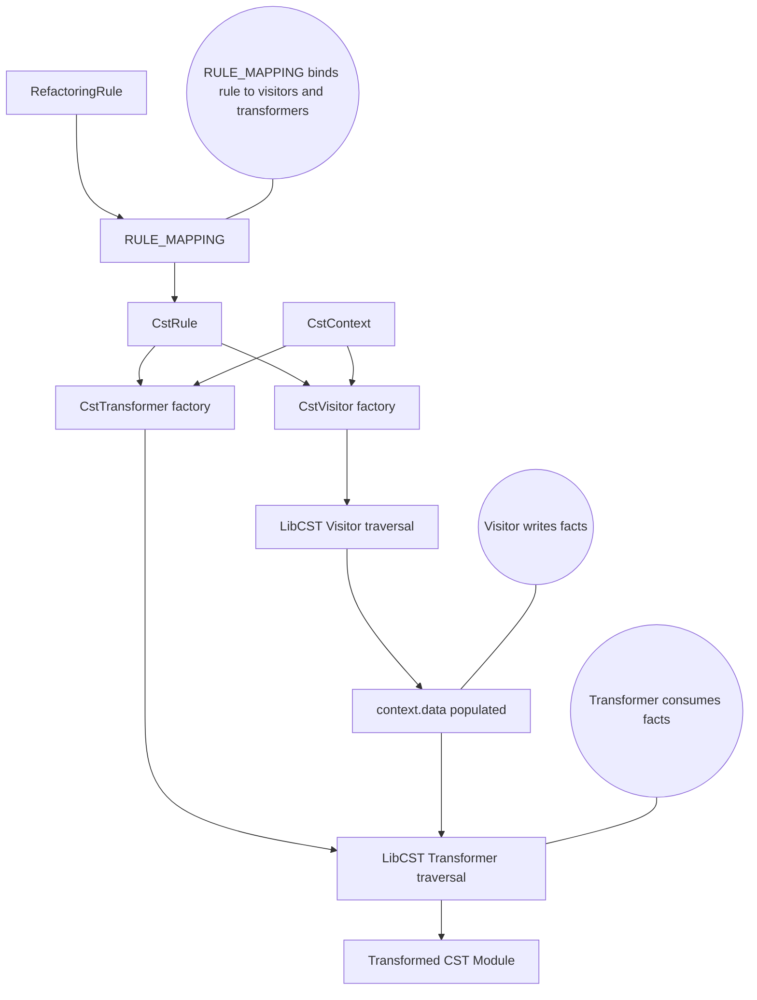

# Arch


```mermaid
flowchart TD

A[RefactoringRule] --> B[RULE_MAPPING]
B --> C[CstRule]
C --> D[CstVisitor factory]
C --> E[CstTransformer factory]
F[CstContext]
F --> D
F --> E
D --> G[LibCST Visitor traversal]
G --> H[context.data populated]
E --> I[LibCST Transformer traversal]
H --> I
I --> L[Transformed CST Module]

%% notes
note1((Visitor writes facts)) --- H
note2((Transformer consumes facts)) --- I
note3((RULE_MAPPING binds rule to visitors and transformers)) --- B
```


# Repo map
```
├── .github
│   └── workflows
├── docs
│   └── source
├── mock_package
│   ├── after
│   │   └── src
│   └── before
│       └── src
├── scripts
├── src
│   └── libcst_code_mods
│       ├── core
│       └── rules
│           ├── general                                                  # general python lints rather than specialised to a particular lib
│           │   ├── active                                               # active rules require user configuration before running and run on a subset of entities
│           │   └── passive                                              # passive rules don't require config and run whenever they see the pattern they alter
│           └── pyspark                                                  # rules that are specific to pyspark
│               └── passive
└── tests
    ├── rules
    │   ├── general
    │   │   ├── active
    │   │   │   ├── add_guards_from_typehints
    │   │   │   ├── add_kwargs
    │   │   │   ├── add_logger_debugs_for_args
    │   │   │   ├── convert_function_signature
    │   │   │   ├── remove_kwargs_if_default_value
    │   │   │   └── reorder_params
    │   │   └── passive
    │   │       ├── assignment_then_guard_to_walrus
    │   │       ├── invert_guards
    │   │       ├── invert_loop_guards
    │   │       ├── replace_multiple_function_calls_in_comp_with_walrus
    │   │       ├── replace_mutable_defaults_with_guard_clause
    │   │       └── replace_nested_list_comps_with_linear_gen_exps
    │   └── pyspark
    │       └── passive
    │           ├── replace_multiple_with_column_calls
    │           ├── replace_multiple_with_column_renamed_calls
    │           ├── replace_with_column_in_for_loop
    │           └── replace_with_column_renamed_in_for_loop
    └── test_examples

(generated with repo-mapper-rs)
::
```
